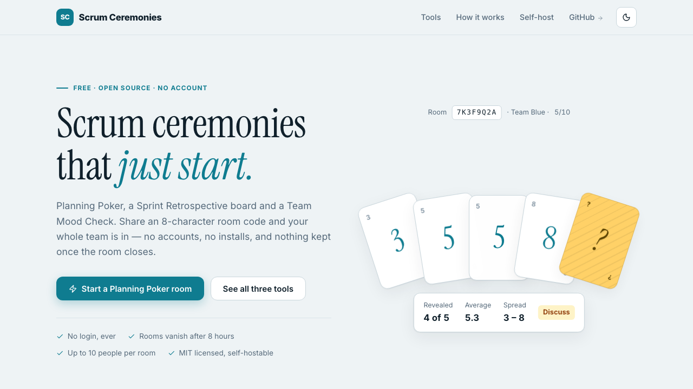
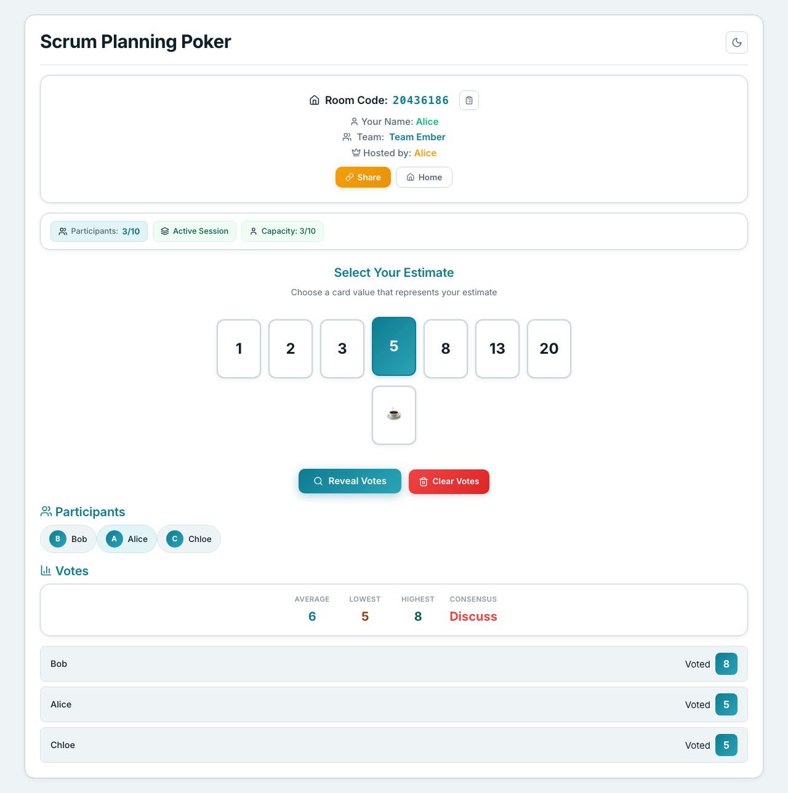
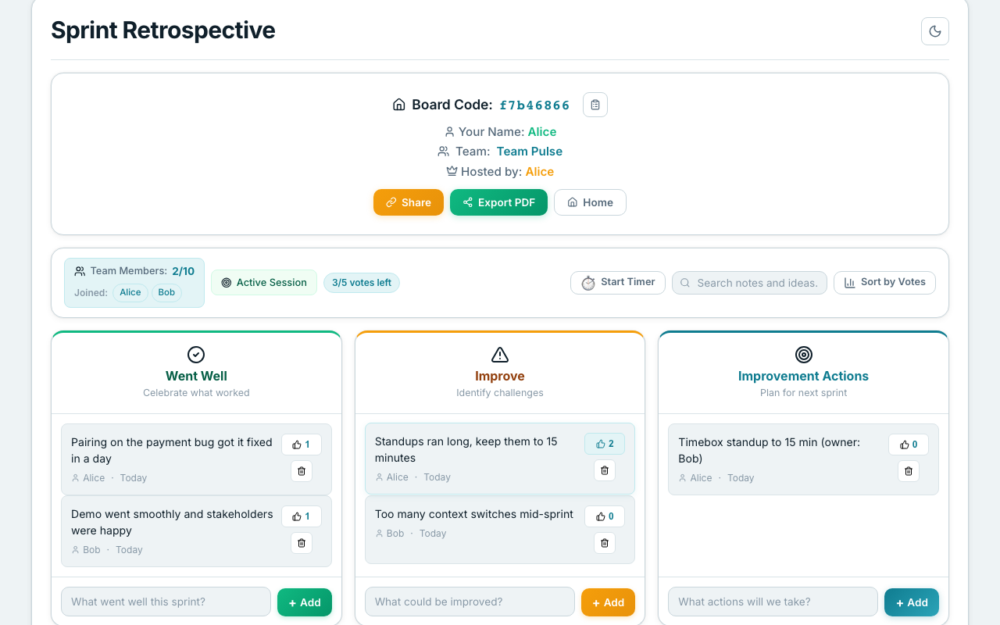
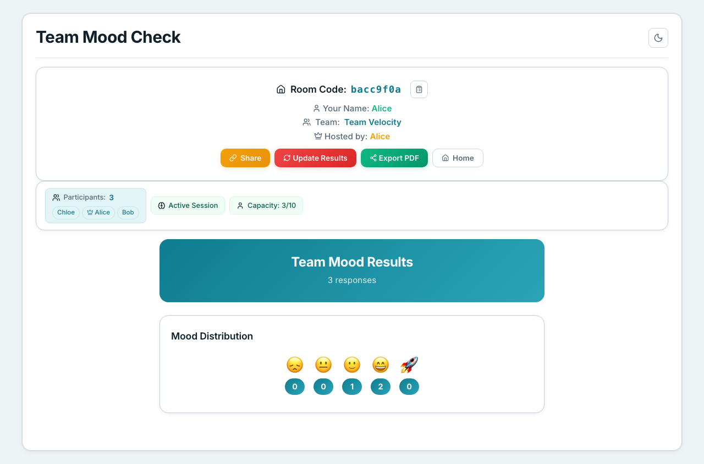
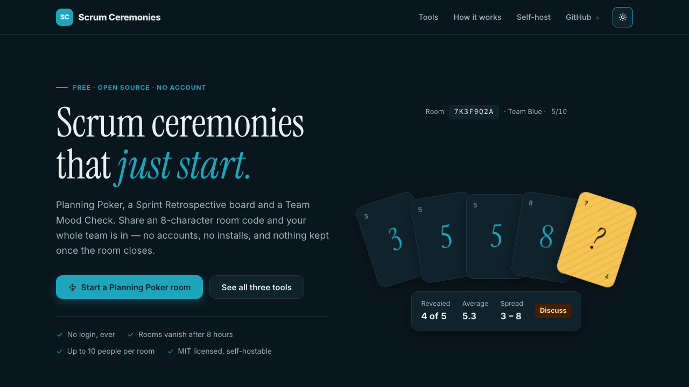

<div align="center">

# Scrum Ceremonies

**Anonymous, real-time Planning Poker, Sprint Retrospective and Team Mood Check.**<br>
Share an 8-character room code and start. No accounts, no database, nothing kept longer than eight hours.

[](https://github.com/rebcoder/scrum-ceremonies/actions/workflows/build-and-test.yml)
[](LICENSE)




</div>

## Why

- **Zero friction.** Open a tool, type a name, share the code. Teammates join in one click, on any device.
- **Real time.** Votes, cards and moods sync instantly over WebSockets. Up to 10 people per room.
- **Nothing to leak.** Rooms live in Redis under an 8-hour TTL and then they are gone. No logins, no email, no analytics, no third-party calls of any kind.
- **Yours to run.** One JVM and one Redis. Docker Compose or a bare `mvn spring-boot:run`.

## The three ceremonies

<table>
  <tr>
    <td width="50%" valign="top">
      <h3>Planning Poker</h3>
      <p>Estimate backlog items together. Everyone picks a card, the host reveals, and the room sees the spread, the average and whether it reached consensus.</p>
      
    </td>
    <td width="50%" valign="top">
      <h3>Sprint Retrospective</h3>
      <p>Three columns, live cards from everyone, dot-voting to surface what matters, a timer, search, sort by votes and a PDF export to take away.</p>
      
    </td>
  </tr>
  <tr>
    <td width="50%" valign="top">
      <h3>Team Mood Check</h3>
      <p>An anonymous pulse. Quick Pulse is one tap; Scrum Pulse adds questions on blockers and confidence. Comments are only shown once three or more people have answered.</p>
      
    </td>
    <td width="50%" valign="top">
      <h3>Dark mode, mobile, accessible</h3>
      <p>Every tool works at phone widths, respects <code>prefers-reduced-motion</code>, keeps focus traps on its dialogs and labels every control for screen readers. A guard spec keeps it that way.</p>
      
    </td>
  </tr>
</table>

## Quick start

You need **JDK 17**, **Node 20+**, and **Docker** (or a local Redis on `:6379`).

```bash
git clone https://github.com/rebcoder/scrum-ceremonies.git
cd scrum-ceremonies
./scripts/dev-up.sh          # redis (docker) → backend :8080 → frontend :3000
```

Open <http://localhost:3000>. `Ctrl+C` stops everything except Redis.

<details>
<summary>By hand</summary>

```bash
docker compose up -d redis
mvn spring-boot:run -Dspring-boot.run.profiles=dev      # API + WebSocket on :8080
cd frontend/v1 && python3 -m http.server 3000            # static pages on :3000
```

The pages call the API on the origin they were served from. When the static
server and the API are on different ports, as above, create
`frontend/v1/config.local.js` (gitignored; `dev-up.sh` writes it for you):

```js
window.APP_CONFIG = {
  API_BASE_URL: 'http://localhost:8080',
  WS_BASE_URL: 'http://localhost:8080/ws'
};
```
</details>

## Self-hosting

`docker-compose.yml` starts Redis and the API together; the `Dockerfile` is a
multi-stage, non-root build. Build the frontend once and serve `frontend/dist/`
from any static host, or from the same reverse proxy as the API, which then needs
no client configuration at all.

```bash
cd frontend && npm ci && node scripts/build.js           # → frontend/dist/
docker compose up -d                                    # redis + api on :8080
```

| Variable | Why |
|---|---|
| `APP_CORS_ALLOWED_ORIGINS` | Your origin(s), comma-separated. The default is localhost only. |
| `SPRING_REDIS_HOST` / `SPRING_REDIS_PORT` | Where Redis lives. `SPRING_REDIS_PASSWORD` and `SPRING_REDIS_SSL` are honoured too. |
| `APP_HTTPS_ENABLED=true` | Marks session cookies secure when TLS terminates in front of the app. |
| `METRICS_SCRAPE_TOKEN` | Bearer token for `/actuator/prometheus`. Unset means the endpoint serves nothing, deliberately. |
| `APP_USE_SIMPLE_BROKER=false` | Switch to a RabbitMQ STOMP relay when you run more than one backend instance. |

The build also writes `staticwebapp.config.json` (routes and security headers) for
hosts that read it; other hosts ignore it. Keep Redis off the public internet: it
holds every room's contents. [`SECURITY.md`](SECURITY.md) has the rest.

## How it works

- **Backend:** Java 17, Spring Boot. REST under `/api/*`, STOMP over SockJS at `/ws`.
- **State:** Redis only. Rooms, boards and mood sessions are JSON values with an 8-hour TTL. Rate limiting and room presence are Lua scripts, so every check-then-write is atomic.
- **Frontend:** vanilla HTML, CSS and JavaScript in `frontend/v1/`, minified by Terser and CleanCSS into `frontend/dist/`. Vendored libraries only; no CDN, no fonts service.
- **Scaling:** a single instance uses Spring's in-memory STOMP broker. For more, set `APP_USE_SIMPLE_BROKER=false` and point it at RabbitMQ.

Guarantees the code enforces and the tests pin: max 10 users per room, 8-hour TTL,
room creation limited to 5/min, 20/hr and 100/day per IP, and the REST paths and
WebSocket topics never change. [`CONTRIBUTING.md`](CONTRIBUTING.md) spells them out.

## Tests

```bash
mvn verify                              # 392 backend testcases + 60%-line coverage gate; needs Redis on :6379
SKIP_CACHE_TESTS=false mvn verify       # + the Testcontainers cache suites (needs Docker)
npm install && npx playwright test      # 87 e2e tests; needs the backend running (dev profile)
bash scripts/api-smoke-test.sh          # 16 endpoint checks against a running backend
```

## Documentation

| | |
|---|---|
| [`docs/LOCAL_DEV.md`](docs/LOCAL_DEV.md) | Runbook: getting the stack up, and what to do when it will not |
| [`docs/V1_TOOLS.md`](docs/V1_TOOLS.md) | Reference: data models, every endpoint, every STOMP destination |
| [`CONTRIBUTING.md`](CONTRIBUTING.md) | Ground rules, conventions, how to verify a change |
| [`SECURITY.md`](SECURITY.md) | Reporting a vulnerability, and what is in scope |
| [`/swagger-ui`](http://localhost:8080/swagger-ui) | Interactive API docs, served by the running backend |

## Contributing

Issues and pull requests are welcome. Start with [`CONTRIBUTING.md`](CONTRIBUTING.md).

## License

[MIT](LICENSE)
